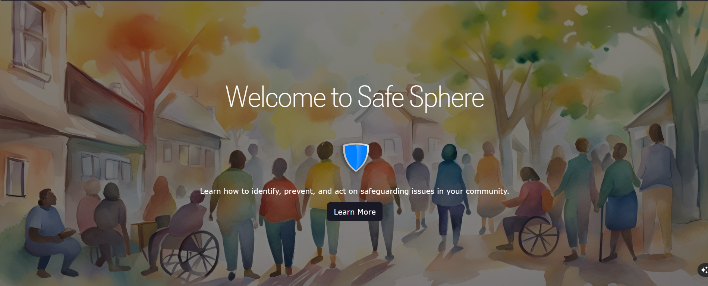
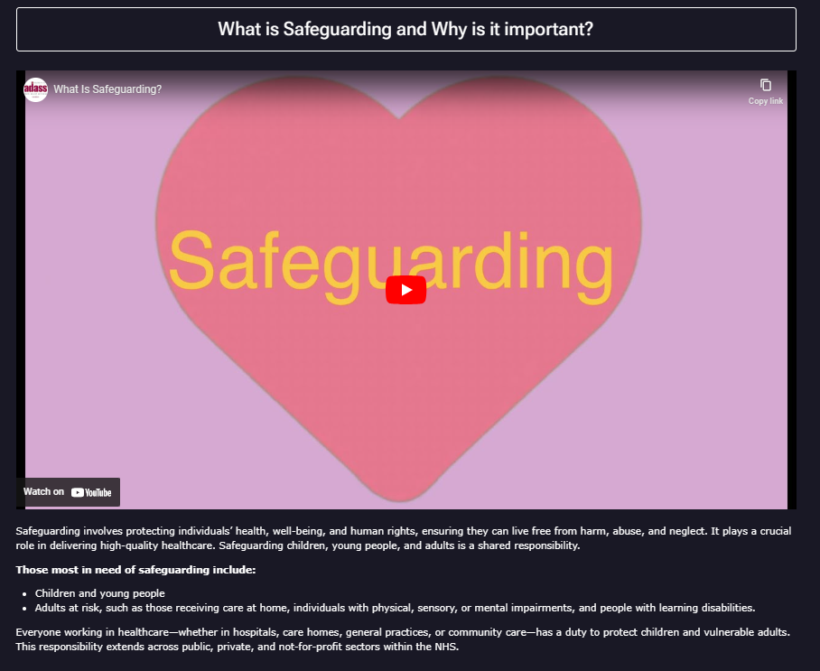
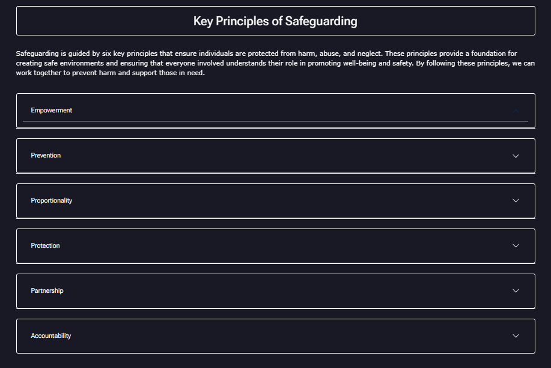
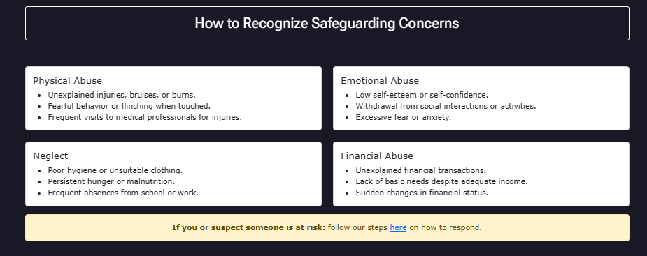
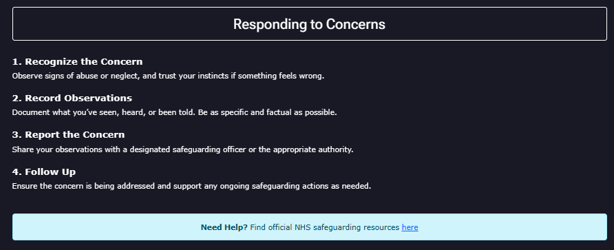
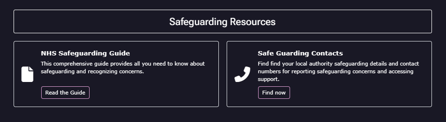
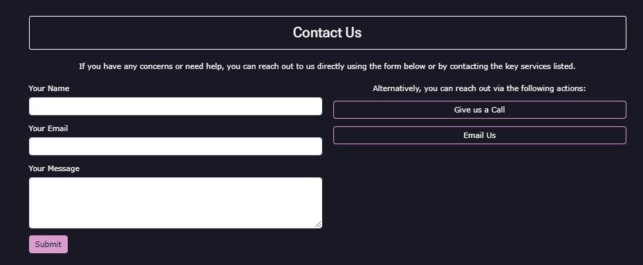
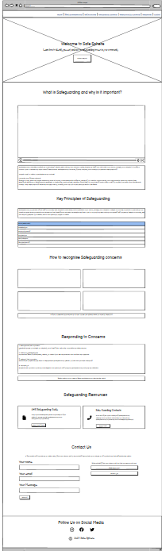

# Safe-Sphere

## Project Overview

The project aims to provide a user-friendly webpage that delivers clear and concise information on safeguarding practices. The primary goal for external users is to access easy-to-understand guidance on recognizing and responding to safeguarding concerns. To achieve this, the site features structured content designed to be accessible and straightforward.

For the site owner, the objective is to create a simple yet effective platform using basic HTML and CSS. The layout emphasizes clarity and intuitiveness, ensuring that users can quickly find and comprehend the key principles of safeguarding.

## List of Features

- Nav bar: Nav bar allowing user to access all points of the site. 

- Hero Section: Brief description.

- What is Safe Guarding: description

- Key Principles of Safe Guarding: Brief description.

- How to Recognise Safeguarding Concerns: Brief description.

- Responding to Concerns: 

- Safe Guarding Resources: 

- Contact Us: 

- Footer:  

## UX/UI

### Site Goals
The primary goal of the site is to provide clear and accessible information about safeguarding practices. It is designed to help users recognize and respond to safeguarding concerns effectively. The site owner aims to ensure the content is well-structured and easy to navigate, delivering an intuitive user experience.

### Design Choices

- **Color Scheme:** A neutral and professional color palette to ensure readability and convey a sense of trust.
- **Typography:** Simple and legible fonts to prioritize clarity.
- **Layout:** A clean and minimalistic design with a focus on structured content and intuitive navigation.
- **Responsiveness:** Ensuring the site is mobile-friendly and performs well on all screen sizes.

### Wireframes

Wireframes were created to outline the structure and layout of the site before development.

## Testing

- **Lighthouse automated testing:** 

The results from the lighthouse test show more work is needed in order to follow best practices, improve performance and make more accessible. 

- **Manual Testing:** Specific scenarios tested manually.
- **Valifdation Tools:** The HTML and CSS have both been run through the WC3 validation services and both contain valid code with no errors. 

## Deployment

The site was deployed using GitHub Pages. Below are the steps taken to deploy the project:

1. **Pre-requisites:**
   - A GitHub account.
   - A repository containing the project files.

2. **Deployment Steps:**
   - Push all project files to the main branch of the GitHub repository.
   - Go to the repository settings.
   - Navigate to the "Pages" section.
   - Under "Source," select the branch (e.g., `main`) and folder (e.g., `/root`) where the site files are located.
   - Save the settings. GitHub will automatically build and deploy the site.

3. **Hosting Platform:**
   - The site is hosted on GitHub Pages and is accessible via a public URL provided by GitHub (`https://CARRIXK.github.io/safe-sphere/`).

## Citation of All Sources

### Images

The image used in the hero section was taken from: https://www.stockvault.net

## Future Features

- Ensure lighthouse scores for accessibility are 100
- Ensure lighthouse scores for best practices are 100
- Ensure lighthouse scores for perfromance are near 100

## Known Bugs

- **Bug 1:** Links on navbar are black before turning pink when hovered over. This could be the custom javascript interfering with the link styling

